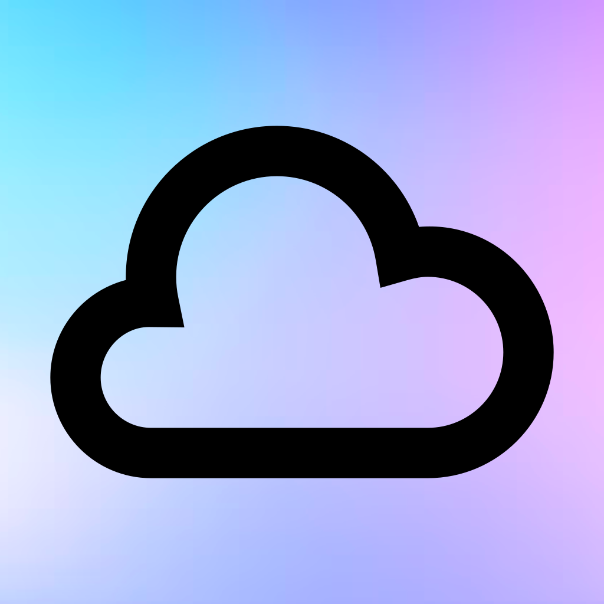

iOS Weather App using Swift Storyboard
# Weather App


## Description

The Weather App is a simple iOS application that provides real-time weather info of the User's current Location along with Weather data of Popular Cities 

## Screenshots

 

## Getting Started

To get started with the Weather App, follow these steps:
1. Clone the repository to your local machine.
   ```shell
   git clone https://github.com/meanarchist/iOSWeatherApp
2. Open the project in Xcode.
3. Build and run the app on a simulator or physical iOS device.
4. Allow location access to get weather data for your current location.
5. Explore weather information for your current location and major cities.
# Dependencies
The Weather App relies on the following dependencies:
- [CoreLocation](https://developer.apple.com/documentation/corelocation): Used for location services to determine the current location.
- [UIKit](https://developer.apple.com/documentation/uikit): Used for building the user interface.
# API Key
To retrieve weather data, the app uses the WeatherAPI service. You will need to sign up for a free API key from their website and replace it in the code where indicated.
# Contributing
If you'd like to contribute to this project, please follow these guidelines:
1. Fork the repository.
2. Create a new branch for your feature or bug fix.
3. Make your changes and test them thoroughly.
4. Create a pull request to merge your changes into the main branch.
5. Be sure to provide a detailed description of your changes and any relevant context.
# License
This project is licensed under the MIT License - see the LICENSE file for details.
# Acknowledgments
- Weather data provided by WeatherAPI.
- Icons by Iconfinder.
# Contact
If you have any questions or suggestions, feel free to contact me:
- Your Name
  - GitHub: [GitHub](https://github.com/meanarchist)
  - Email: tj2557@columbia.edu
# Credits
This app was developed by Tharun Kumar Jayaprakash.
